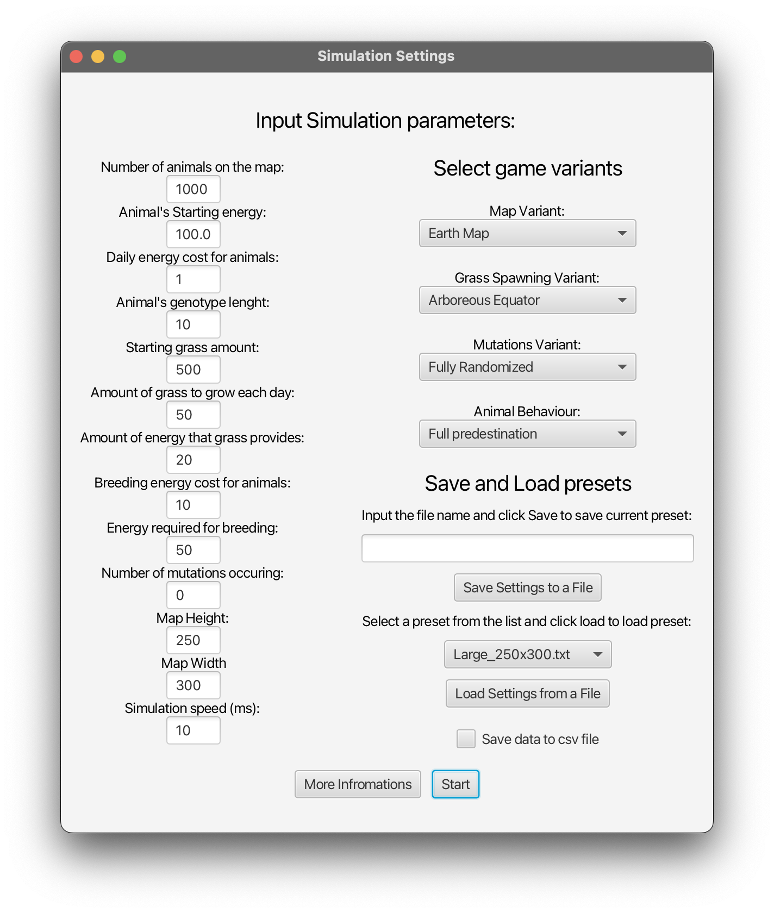
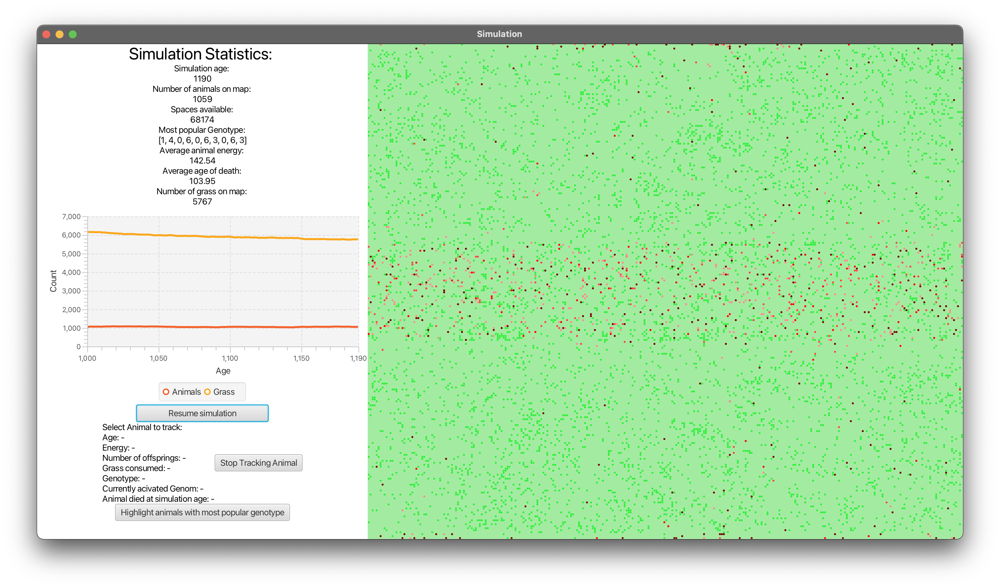
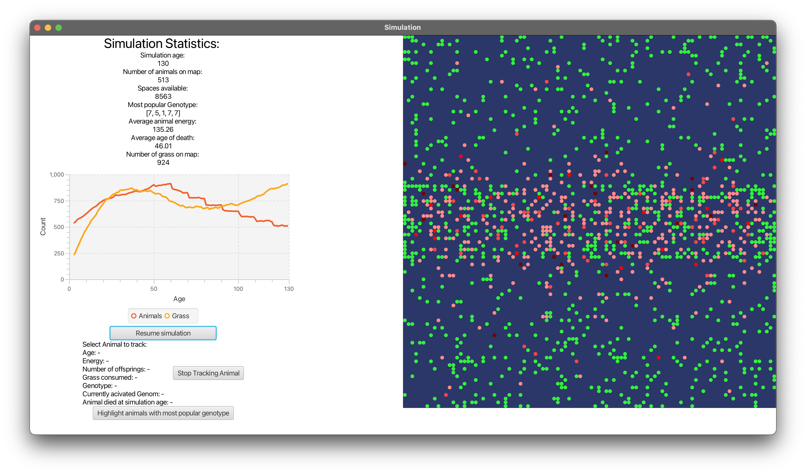

# Animal evolution simulator
Simple animal evolution simulator written in java and JavaFX.

To run the game clone the repo and use `./gradlew run` command

### The menu
Choose the starting settings for the simulation or load one of the presets from the menu.
You can also save your set-up as a preset to run later on. From a single menu screen, many 
simulations may be launched. Each running on a separate thread.
Check the "Save data to CSV file" to save the game progress and information
age-by-age to a csv file. 

### The map
Grass consumed by animals is displayed as a green circle on the map. It 
is spawned on the map either near the "equator" or on the fields that the least amount 
of animals had died on, depending on the menu setting.
Animals health is displayed as a shade of red, 
the darker the colour the more energy an animals has.
If two animals are on the same field and have sufficient energy, they 
can create a new animal, giving up part of their energy to the baby.
Baby's genom is constructed based on theirs parents and possible mutations.

### Other variants and options
When switching the map variant to portal, animals teleport to a random location on the map instead 
of "going around the edge" like in the earth setting. When simulation is paused, it
is possible to click on an animal on the map, that is then highlighted and
it's stats are shown on the left of the screen until it dies or stops being tracked.

### Additional information

When trying to launch the simulation with user's own setting, there might 
be an error popping up. It indicates that some setting has been set incorrectly.
Some settings like simulation speed are limited to above 10ms to avoid
stability issues.

